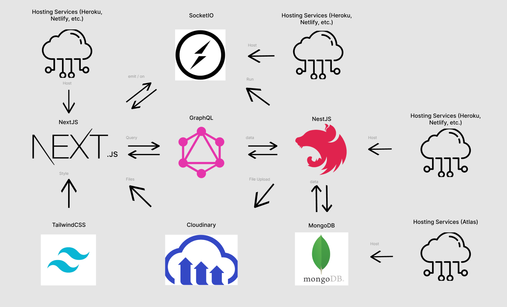
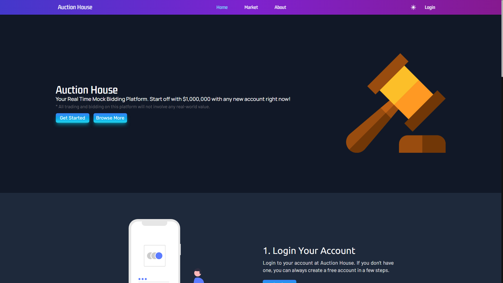
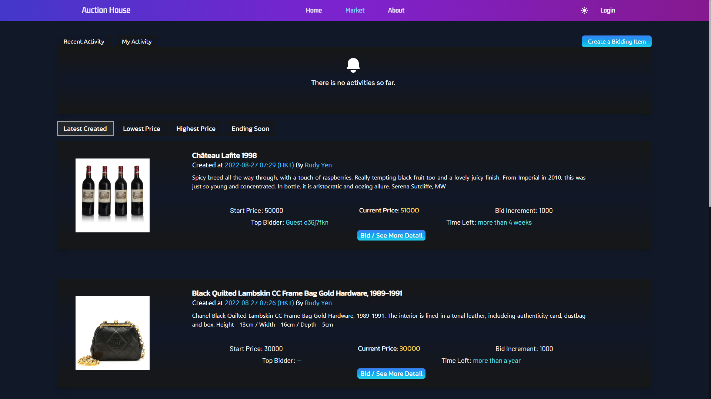
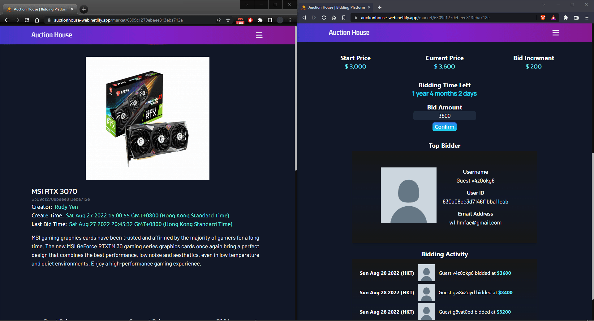
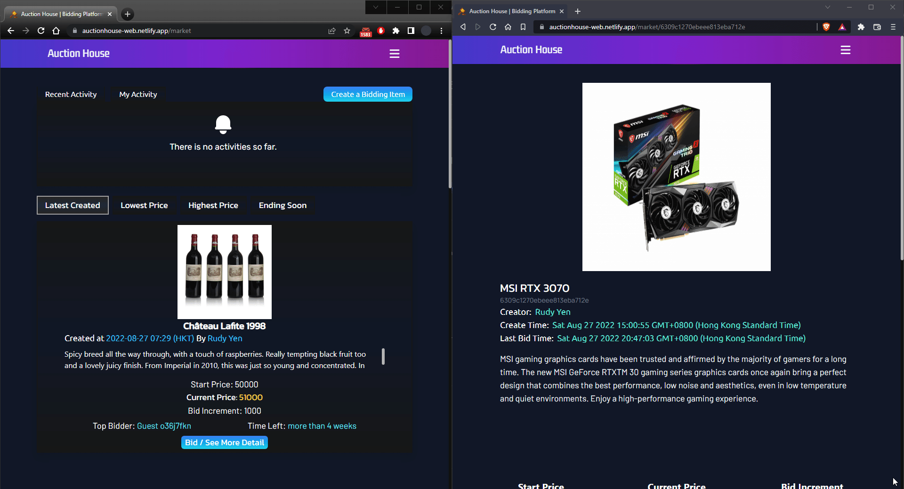
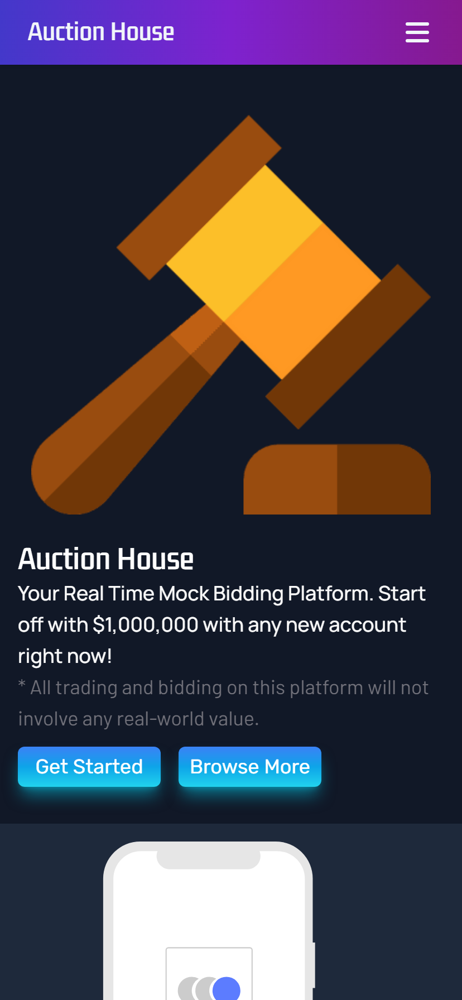
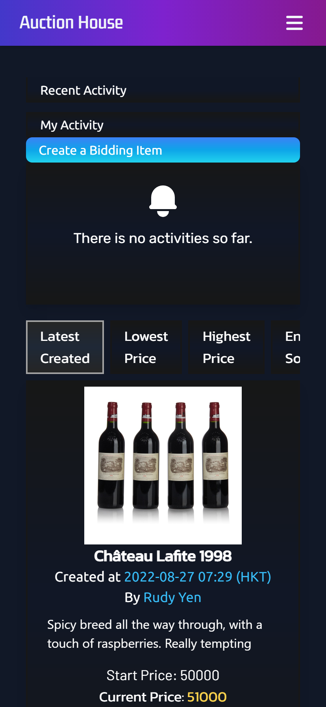
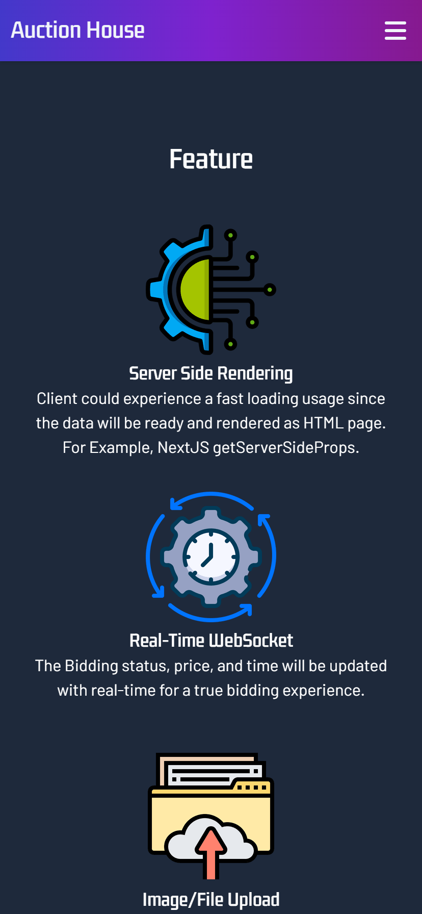
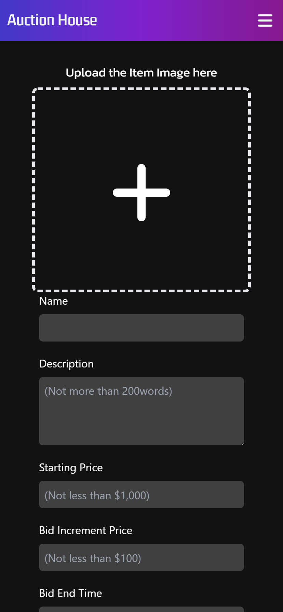

# Auction House

## Table of Contents
* [Introduction](https://github.com/yenloned/AuctionHouse#introduction)
* [Live Demo](https://github.com/yenloned/AuctionHouse#live-demo)
* [Technologies](https://github.com/yenloned/AuctionHouse#technologies)
* [Getting Started](https://github.com/yenloned/AuctionHouse#getting-started)
* [Architectures](https://github.com/yenloned/AuctionHouse#architectures)
* [Design](https://github.com/yenloned/AuctionHouse#design)
* [Functions](https://github.com/yenloned/AuctionHouse#functions)
* [Features](https://github.com/yenloned/AuctionHouse#features)
* [Preview](https://github.com/yenloned/AuctionHouse#preview)
* [Epilogue](https://github.com/yenloned/AuctionHouse#epilogue)

## Introduction
Auction House is a real-time mock bidding website, which provides fast and real-time bidding functions by GraphQL API and Socket.IO. It does not involve any real currencies, trading, bidding, or buying and selling since this project is aimed to demo the web development technologies and practice.

## Live Demo
[https://auctionhouse-web.netlify.app/](https://auctionhouse-web.netlify.app/)

## Technologies
**FrontEnd**
* [NextJS](https://nextjs.org/)
* [TailwindCSS](https://tailwindcss.com/)

**Backend**
* [GraphQL](https://graphql.org/)
* [NestJS](https://nestjs.com/)
* [MongoDB](https://www.mongodb.com/)

**Other Highlighted Libraries**
* [Socket.IO](https://socket.io/)
* [Apollo-GraphQL](https://www.apollographql.com/)
* [Cloudinary](https://cloudinary.com/)
* [Loadash](https://lodash.com/)

## Getting Started
```node
npm install
npm run dev

cd backend
npm install
npm start
```

Open [http://localhost:3000](http://localhost:3000) and you will see the page appear.

## Architectures
### Overview


## Design
* Fully Responsive
* Server Side Rendering
* GraphQL API
* Real-time System (WebSocket)

## Functions
* Avatar/Icon Upload
* Bidding Item
* Create Item

## Features
* Dark/Light Mode
* Searching / Categories
* Recent Activity
* Image Upload

## Preview
### <p align="center">Desktop View</p>
||
|----------------------------------------|
||
||

### <p align="center">Real-Time Demo</p>
||
|----------------------------------------|
||
||

### <p align="center">Phone View</p>
| | | | |
|-------------------------------|-------------------------------|-------------------------------|-------------------------------|
|||||

## Epilogue
This project is mainly focused on the Real-Time mechanism carried by WebSocket and GraphQL API. It is my first try and a great learning experience. Please feel free to reach out if you have any suggestions!


